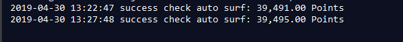

# alexamaster-autosurf
通过puppeteer，实现alexamaster自动挂机刷积分

有关alexamaster的介绍，可以[看此文章](https://www.youneed.win/alexamaster基本介绍，闲置vps挂机赚钱.html)，下面讲述了本项目的具体使用方法
 
## 运行环境

本项目依赖node.js，因此使用之前，请先确保安装了最新稳定版本的node.js。

## 运行程序

- 克隆本项目代码 `clone https://github.com/dxxzst/alexamaster-autosurf.git`
- 修改lib/pub.js文件中的surURL为你的URL
- 进入目录 `cd alexamaster-autosurf`
- 安装资源 `npm install`
- 启动服务 `npm start` 或 `node index.js`

程序运行后，会每隔5分钟输出一次log，内容为当前时间的积分

## 备注

程序运行时，会自动检查错误，比如启动失败、浏览器卡死导致积分没有增加等等。
出现错误后会自动重启浏览器。

**如本项目对您有所帮助，欢迎Star。**
